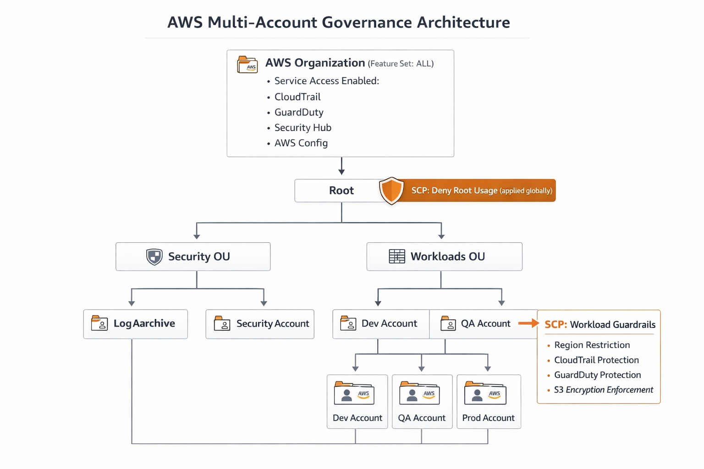

# AWS Multi-Account Secure Architecture (Terraform)

## Overview
This project implements a production-grade AWS multi-account architecture using AWS Organizations, designed with strong security, governance, observability, and high availability principles.

The system separates responsibilities across multiple AWS accounts (Management, Security, Log Archive, and Workloads) and enforces centralized control using SCPs, IAM role-based access, and automated security monitoring.

Infrastructure is fully defined using Terraform with a modular design.

---

## Architecture Highlights
- Multi-account AWS Organization (Management, Security, Log Archive, Dev, QA, Prod)
- Service Control Policies (SCPs) for governance and guardrails
- Centralized logging using organization-wide CloudTrail
- KMS encryption for all sensitive data
- GuardDuty + Security Hub for threat detection
- EventBridge + Lambda for automated response
- Multi-AZ VPC architecture for high availability
- Auto Scaling workloads behind Application Load Balancer
- Cross-region disaster recovery using S3 replication

---

## Architecture Diagram

---

## Account Structure

| Account        | Purpose                     |
|----------------|-----------------------------|
| Management     | Organization & governance   |
| Security       | Central security monitoring |
| Log Archive    | Centralized logging storage |
| Dev / QA / Prod| Workload environments       |

---

## Security Design

### SCP Enforcement
- No root usage
- Region restrictions
- Mandatory encryption
- Protection of security services

### IAM Strategy
- Role-based access only (no IAM users)
- Permission boundaries applied
- Cross-account access model

### Encryption
- KMS for S3, CloudTrail, and replication
- Encryption enforced at rest

---

## Monitoring & Detection
- AWS GuardDuty (organization-wide threat detection)
- AWS Security Hub (centralized findings)
- AWS Config (compliance tracking)
- EventBridge rules for real-time alerting
- Lambda for automated response workflows

---

## Networking
- VPC per environment (Dev, QA, Prod)
- Public and private subnets across multiple AZs
- NAT Gateway for outbound traffic
- Application Load Balancer (ALB) for secure exposure
- EC2 instances isolated in private subnets

---

## Disaster Recovery

**Strategy:** Active–Passive (backup-based)

### Implementation
- Cross-region S3 replication (`us-east-1 → us-west-2`)
- Separate KMS keys per region

### Objectives
- **RPO:** Near real-time (seconds to minutes)
- **RTO:** 30 minutes – 2 hours

### Scope
- Protects critical logs and S3 data
- Compute recovery requires redeployment via Terraform

---

## Terraform Design
- Modular architecture
- Separate modules:
  - global
  - logging
  - security
  - network
  - workload

- Remote backend using S3 with DynamoDB state locking

---
